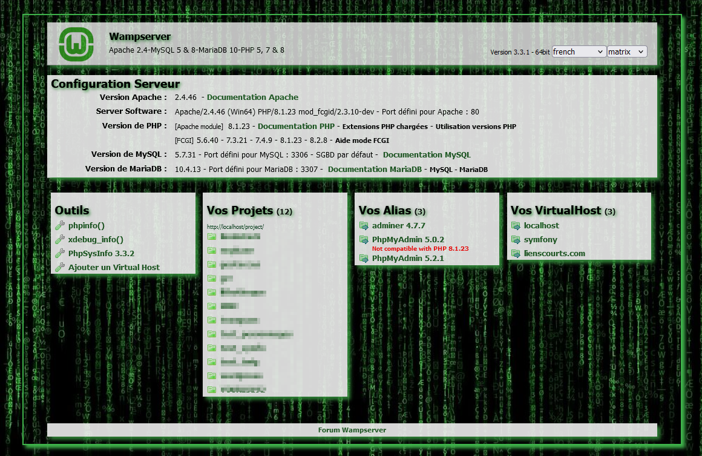

Template pour WampServer
===============

**Requiert :**
Compatible version 3.3 de wampserver

----------
Installation
-------------

Récupérer ce dépôt et rajouter le thème souhaité dans le dossier d'installation de Wampserver (le plus souvent wamp64/www/wampthemes)

**Aperçu :**

Matrix :

